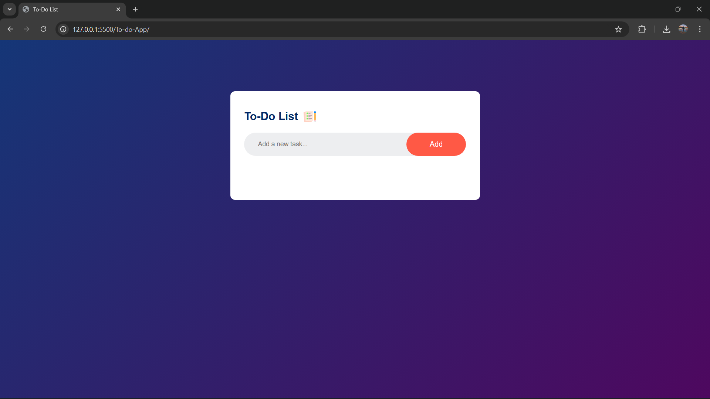
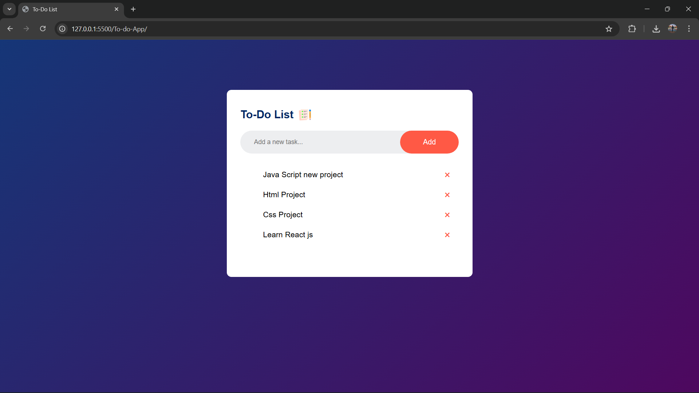
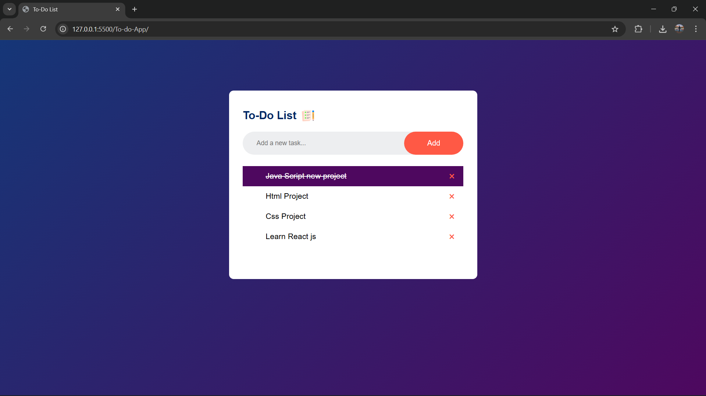
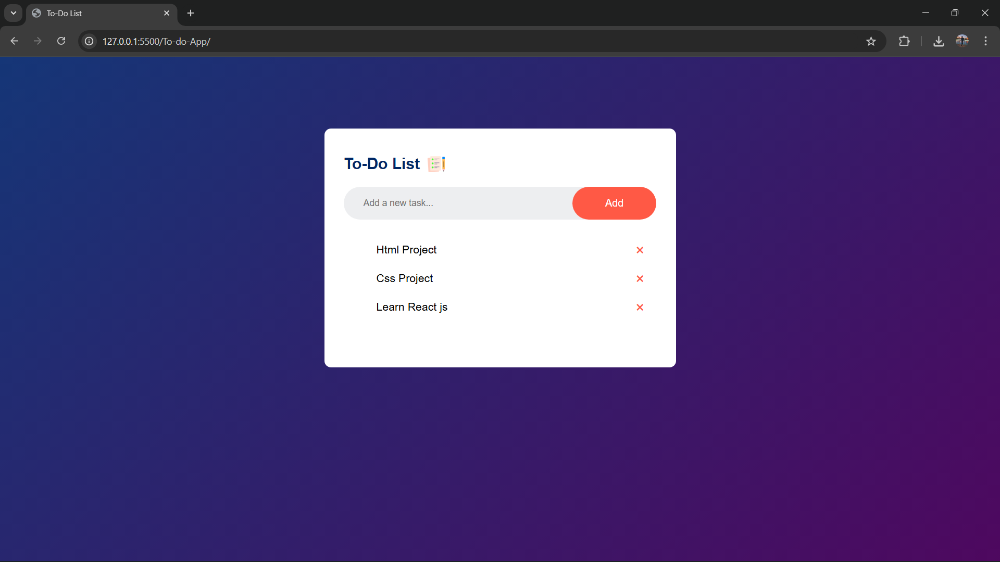

# To-do-App

# To-Do List Application

A simple and elegant To-Do List web application built with HTML, CSS, and JavaScript. This app allows users to add, mark as complete, and delete tasks. Tasks are saved in the browser's local storage, so your list persists even after refreshing or closing the browser.

## Features

- Add new tasks to the list.
- Mark tasks as completed with a visual strike-through effect.
- Delete tasks with a clear "×" button.
- Tasks are saved automatically to **localStorage** for persistence.
- Responsive and clean user interface with smooth interactions.

## Technologies Used

- **HTML** for structure.
- **CSS** for styling and layout.
- **JavaScript** for interactivity and data management.

## How to Use

1. Type a new task in the input box.
2. Click the **Add** button to add the task to your list.
3. Click on a task to mark it as completed or uncompleted.
4. Click the red "×" button to delete a task.
5. Your tasks will be saved automatically and loaded when you revisit the page.

## Installation

1. Clone or download this repository.
2. Open the `index.html` file in your preferred web browser.

## Screenshots

  <!-- Image 1 -->
  
   
  Interface.
   

  <!-- Image 2 (make sure the extension is correct, e.g., .png) -->
  
   
  Task added.
   

  <!-- Image 3 -->
  
   
  Completed tasks.
   

  <!-- Image 4 -->
  
   
  After completeing the task that task is deleted.
   

